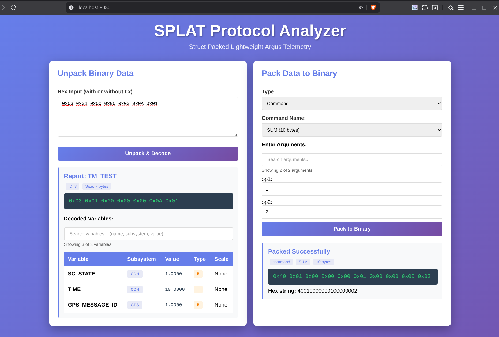

# SPLAT - Struct Packed Lightweight Argus Telemetry

I was working on the development of a small satellite and was looking for a communication protocol for the telemetry. It had to be simple, no dependencies, work only in python, be fairly lightweight, and fast. It should also be easy to implement. 

I have worked with a couple of communication protocols before and none of them really fit the bill. Plus all of them also had some things that annoyed me. I also searched around for a new protocol, but I could not find that either. So I decided to make my own protocol.

Instead of using something like protobuf to serialize the data, I decided to use python's built-in struct module to pack and unpack the data. This makes the protocol very lightweight and fast. It also makes it easy to implement, as you only need to know how to use the struct module.

A lightweight, fast Python-based satellite communication protocol using `struct` for binary packing/unpacking.

> the data the the satellite and gs will send will have extra header bytes that as of right now are not part of this protocol. but could be implemented here

## 📁 Project Structure

```
satellite-comms/
├── splat                        # to maintain compativility with the satellite and gs structure
|  ├── telemetry_definition.py    # Variable, report, and command definitions
|  ├── telemetry_helper.py        # Helper functions (size calculations, validation)
|  └── telemetry_codec.py         # Pack/unpack functions and template classes
├── splat_web                    # Python web app to help encode and decode data
└── README.md                    # This file
```

## 🎯 Design Principles

1. **Lightweight**: Minimal overhead, direct binary packing
2. **Fast**: Native Python struct module
3. **Type-safe**: Strongly typed variables and commands
4. **Scalable**: Easy to add new variables, reports, commands
5. **Organized**: Subsystem-based organization
6. **Testable**: Built-in validation and testing tools


## WebUi
There is a simple web UI made with python using flask. It has a simple UI that allows to paste bytes and it will try and decode them. It also allows to create reports and commands and pack them to bytes. 

``` bash
python splat_web/app.py

# visit localhost:8080 in your browser
```



## 📚 Core Components

### 1. telemetry_definition.py

Defines all protocol elements:
- **Variables**: Individual data points (time, temp, voltage, etc.)
- **Reports**: Groups of variables sent together
- **Commands**: Operations that can be sent to the satellite
- **Configuration**: Endianness, max packet size, string lengths

Note that the susbsystem needs to have the same name as the DH subsystems, and the variables need to have the same name as the varaibles defined in DH.

The command name does not matter, but the precondition and the function to be called on the satellite need to have the same name as the respective functions in the satellite code.

```python
# Example variable definition
"temp": ["CDH", "f", 100],  # subsystem, type, scale factor

# Example report definition
"TM_HEARTBEAT": {
    "time": "CDH",
    "temp": "CDH",
    "voltage": "EPS",
}

# Example command definition
("SUM", "valid_inputs", ["op1", "op2"], "SUM"),
```

### 2. telemetry_helper.py

Utility functions:
- `get_variable_size(var_name)` - Get size in bytes
- `get_report_size(report_name)` - Get total report size
- `get_command_size(cmd_name)` - Get command and response sizes
- `get_report_format(report_name)` - Get struct format string
- `list_all_variables()` - List all variables
- `list_all_reports()` - List all reports
- `list_all_commands()` - List all commands
- `validate_definitions()` - Check protocol consistency
- `print_summary()` - Print complete protocol summary

### 3. telemetry_codec.py

Core packing/unpacking with template classes:

#### Report Class
```python
# Create a report
report = Report("TM_HEARTBEAT")
report.add_variable("time", "CDH", 1625247600)
report.add_variable("temp", "CDH", 295)

# Or use convenience method
report.set_variables(time=1625247600, temp=295)

# Pack to bytes
packed = pack(report)

# Unpack from bytes
unpacked = unpack(packed)   # this returns a report class object
```

#### Command Class
```python
# Create a command
cmd = Command("SUM")
cmd.add_argument("op1", 300)
cmd.add_argument("op2", 150)


# Pack and send
packed = pack(cmd)

# Unpack received command
received_cmd = unpack(packed)
```

#### Variable Class
```python
# Create a variable
var = Variable("temp", "CDH", "f", 100)
packed_var = var.pack(295.15)  # pack a value
unpacked_value = var.unpack(packed_var)  # unpack to get original value
```

## Limitations
1. As of right now responses are not implemented.
2. As of right now it is not possible to use string as arguments
3. It is not possible to have strings as variables as well
4. scaling is not implemented yet

## Work on

1. **Transport layer.** Not sure if this should be implemented here or on another layer, but it will be necessary to transmit images. I started thinking on a message type called `Big_packet` that could be used to help implement image transmission. It would have the following fields: `transaction_id`, `number_of_packets`, `packet_number`. It would be interesting to look at it as transactions. When you start a transaction, it will take time to be completed, the satellite will send multiple packets and the GS will receive them and use them to build the transaction.

2. **The current layout of `telemetry_definition.py` is not the best**, especially towards the end of the file; there are a lot of optimizations that could be made there. It would also be nice to stop referencing variables and reports by name in the internal code and just reference them by ID.

3. **Variable check.** When you try and pack a float into an int variable, it will fail and debugging which variable is causing the problem is not very easy. It would be nice to have an option (maybe with a debug flag) that would check the variables and show which variable is causing the problem.

4. **Remove hard coded endianness.** In the packing and unpacking functions, especially when dealing with the headers, there are some hard coded endianness references. It would be nice to remove those and use the endianness defined in the configuration. Maybe the helper function should be the one generating the headers, and it would be done all in one function.

5. **When generating the format string** for the different types of variables, there is some code that could be put on a single function.

6. **Implementing the scaling feature**, or maybe remove it completely.

7. **Do not love the way arguments are implemented** in the command definition; it is a bit confusing and not very intuitive. It would be nice to have a more clear way to define the arguments and their types.

8. **Would it make sense for the variables in the report to be of the type `Variable`** instead of just a string?

9. **Header def**. Dont love the way it is currently implemented. Should be something better defined in telemetry_definition.py


## 📝 Adding New Elements

### Add a New Variable
In `telemetry_definition.py`:
```python
var_dict = {
    "new_var": ["SUBSYSTEM", "type", scale_factor],
}
```

need to make sure that this variable exists in DH system

### Add a New Report
In `telemetry_definition.py`:
```python
report_dict = {
    "TM_NEW_REPORT": {
        "var1": "SUBSYSTEM1",
        "var2": "SUBSYSTEM2",
    }
}
```

need to make sure that all the variables that are part of the report have been created

### Add a New Command
In `telemetry_definition.py`:
```python
command_list = [
    ("NEW_COMMAND", "precondition_func", ["arg1", "arg2"], "satellite_func"),
]
```

need to make sure that the precondition function and the satellite function exist in the satellite code. Also need to make sure that the arguments are in the argument dict


## ⚙️ Configuration

Key settings in `telemetry_definition.py`:
- `ENDIANNESS`: `'>'` (big-endian) or `'<'` (little-endian)
- `MAX_PACKET_SIZE`: Maximum packet size in bytes (default: 256)
- `MSG_TYPE_SIZE`: Size of message type header in bits (default: 8)
- `REPORT_ID_SIZE`: Size of report/command ID header in bits (default: 5)
- `VARIABLE_SS_SIZE`: Size of variable subsystem header in bits (default: 3)
- `VARIABLE_ID_SIZE`: Size of variable ID header in bits (default: 10)
- `COMMAND_ID_SIZE`: Size of command ID header in bits (default: 13)


## 📡 Binary Encoding Explained

### Message Structure

All messages are packed as binary data using Python's `struct` module with **big-endian** byte order.

#### Common Header Layout (bit-level)

All **reports**, **commands**, and **variables** start with a compact header:

- **msg_type**: `MSG_TYPE_SIZE` bits  
- **report_id**: `REPORT_ID_SIZE` bits  
- **command_id**: `COMMAND_ID_SIZE` bits  
- **variable header**: `VARIABLE_SS_SIZE` + `VARIABLE_ID_SIZE` bits  

The header is packed into the minimum whole number of bytes.

```
Report  Header: [ msg_type | report_id ]
Command Header: [ msg_type | command_id ]
Variable Header: [ msg_type | subsystem_id | variable_id ]
```

#### Report Structure
```
┌───────────────────────────────┬──────────────┬──────────────┬─────┬──────────────┐
│ Header (msg_type + report_id) │  Variable 1  │  Variable 2  │ ... │  Variable N  │
│   (bits per config)           │   X bytes    │   Y bytes    │     │   Z bytes    │
└───────────────────────────────┴──────────────┴──────────────┴─────┴──────────────┘
```

#### Command Structure
```
┌───────────────────────────────┬──────────────┬──────────────┬─────┬──────────────┐
│ Header (msg_type + command_id)│  Argument 1  │  Argument 2  │ ... │  Argument N  │
│   (bits per config)           │   X bytes    │   Y bytes    │     │   Z bytes    │
└───────────────────────────────┴──────────────┴──────────────┴─────┴──────────────┘
```

> The precondition and satellite function are not part of the message. The satellite will identify what command was received and use telemetry definion to know what precondition and satellite function to call.

#### Variable Structure
```
┌─────────────────────────────────────────────┬───────────────────┐
│ Header (msg_type + subsystem_id + var_id)   │     Value         │
│   (bits per config)                         │   X bytes         │
└─────────────────────────────────────────────┴───────────────────┘
```

### Scale Factors

Variables can have scale factors to preserve precision while using integer-like encoding:

```python
"temp": ["CDH", "f", 100]  # Scale factor = 100

Encoding:  295.15 K × 100 = 29515.0 → packed as float
Decoding:  29515.0 ÷ 100 = 295.15 K

"voltage": ["EPS", "f", 1000]  # Scale factor = 1000

Encoding:  3.7 V × 1000 = 3700.0 → packed as float
Decoding:  3700.0 ÷ 1000 = 3.7 V
```

This approach:
- Maintains precision for important measurements
- Keeps packet sizes small
- Avoids floating-point precision issues

> This has not been implemented yet

### Byte Order (Endianness)

The protocol uses **big-endian** byte order (most significant byte first), which is network standard.

```python
Example: Float 300.0 in big-endian
┌────┬────┬────┬────┐
│ 43 │ 96 │ 00 │ 00 │  = 0x43960000 (IEEE 754)
└────┴────┴────┴────┘
  ↑
MSB (Most Significant Byte first)

Same value in little-endian would be:
┌────┬────┬────┬────┐
│ 00 │ 00 │ 96 │ 43 │
└────┴────┴────┴────┘
```

Change byte order by modifying `ENDIANNESS` in `telemetry_definition.py`:
```python
ENDIANNESS = '>'  # Big-endian (network byte order)
# or
ENDIANNESS = '<'  # Little-endian
```

## Python struct format ranges (common standard sizes)

### INTEGER TYPES

| Format | C Type               | Size (bytes) | Min                               | Max                               |
|--------|--------------------|--------------|-----------------------------------|----------------------------------|
| b      | signed char         | 1            | -128                              | 127                              |
| B      | unsigned char       | 1            | 0                                 | 255                              |
| ?      | _Bool               | 1            | False (0)                         | True (1)                         |
| h      | short               | 2            | -32,768                           | 32,767                           |
| H      | unsigned short      | 2            | 0                                 | 65,535                           |
| i      | int                 | 4            | -2,147,483,648                    | 2,147,483,647                    |
| I      | unsigned int        | 4            | 0                                 | 4,294,967,295                    |
| l      | long                | 4            | -2,147,483,648                    | 2,147,483,647                    |
| L      | unsigned long       | 4            | 0                                 | 4,294,967,295                    |
| q      | long long           | 8            | -9,223,372,036,854,775,808        | 9,223,372,036,854,775,807        |
| Q      | unsigned long long  | 8            | 0                                 | 18,446,744,073,709,551,615       |

### FLOATING-POINT TYPES

| Format | C Type     | Size (bytes) | Approx Min     | Approx Max   |
|--------|------------|--------------|----------------|-------------|
| e      | half float | 2            | ±6.10e-05      | ±6.55e+04   |
| f      | float      | 4            | ±1.18e-38      | ±3.40e+38   |
| d      | double     | 8            | ±2.23e-308     | ±1.80e+308  |

### NON-NUMERIC TYPES

| Format | C Type   | Python Type | Notes                     |
|--------|----------|-------------|---------------------------|
| c      | char     | bytes       | Exactly 1 byte            |
| s      | char[]   | bytes       | Fixed-length string       |
| p      | char[]   | bytes       | Pascal string (length byte) |
| P      | void*    | int         | Pointer-sized, platform dependent |
| x      | pad byte | —           | No value                  |


## 📡 Protocol Flow

```
Ground Station                    Satellite
     |                                |
     |  1. Pack Command              |
     |  ---[binary data]-----------> |
     |                                |  2. Unpack Command
     |                                |  3. Process
     |                                |  4. Pack Response
     |  5. Unpack Response            |
     | <---[binary data]-------------  |
     |                                |
```


## 📦 Dependencies

- Python 3.6+
- Standard library only (no external dependencies!)

## 🔧 Usage Examples

### Example 1: Create and Pack a Report
```python
from telemetry_codec import Report, pack
import time

# Create report
report = Report("TM_POWER")
report.set_variables(
    time=time.time(),
    voltage=3.7,
    current=0.5,
    battery_level=85,
    solar_voltage=5.0
)

# Pack to binary
packed_data = pack(report)
print(f"Packed size: {len(packed_data)} bytes")
print(f"Hex: {packed_data.hex()}")
```

### Example 2: Send a Command
```python
from telemetry_codec import Command, pack

# Create command
cmd = Command("SET_POWER_MODE")
cmd.add_argument("mode", 2)

# Pack and send via socket
packed_cmd = pack(cmd)
socket.sendall(packed_cmd)
```

### Example 3: Unpack Received Data
```python
from telemetry_codec import unpack

# Receive data from socket
data = socket.recv(1024)

# Unpack (auto-detects type)
result = unpack(data)

if isinstance(result, Report):
    print(f"Received report: {result.name}")
    print(f"Variables: {result.variables}")
elif isinstance(result, Command):
    print(f"Received command: {result.name}")
```


## 📄 License

This is a template/example implementation for educational purposes.
